# Python Data Analytics: A Learning Journey in Data Cleaning and Visualization

## Introduction 

This project focuses on data cleaning, transformation, and visualization using **Python**. The analysis uses both **artificial datasets** and **datasets created by the author**, which can be found in the **project repository**. By applying **Pandas** for data manipulation and **Matplotlib** for visualization, the project demonstrates how to handle missing values, duplicates, and complex data structures, ultimately extracting meaningful insights from raw data.

The **datasets used** in this project are available for access [here](/datasets).

## Objective 

The objective of this project is to demonstrate effective **data preprocessing** and **visualization techniques** using both artificial and author-generated datasets. It was a **personal learning journey**, guiding me through data transformation, pattern discovery, and quality assurance, while gaining practical experience in end-to-end data analysis in Python.

## Acessing and Cleaning Data

In this project, we began by loading a **CSV dataset into a Pandas DataFrame** and converting the date column to datetime format to facilitate time-based operations. We explored techniques to extract specific characters or substrings from string columns using **.str[]** and direct indexing, including extracting substrings from individual cells. For numeric columns like mean_salary, we converted values to strings to enable digit-level extraction.   

Handling columns containing string representations of lists, such as **skills_list**, required the use of **ast.literal_eval applied** via a **lambda function** to safely convert these strings into actual Python lists, which allowed us to access individual skills within each row.    
We addressed missing data by calculating **median values** for key columns such as recycling_pct, population_size, and num_of_jobs and then used **fillna** to impute these medians, ensuring a complete dataset. 
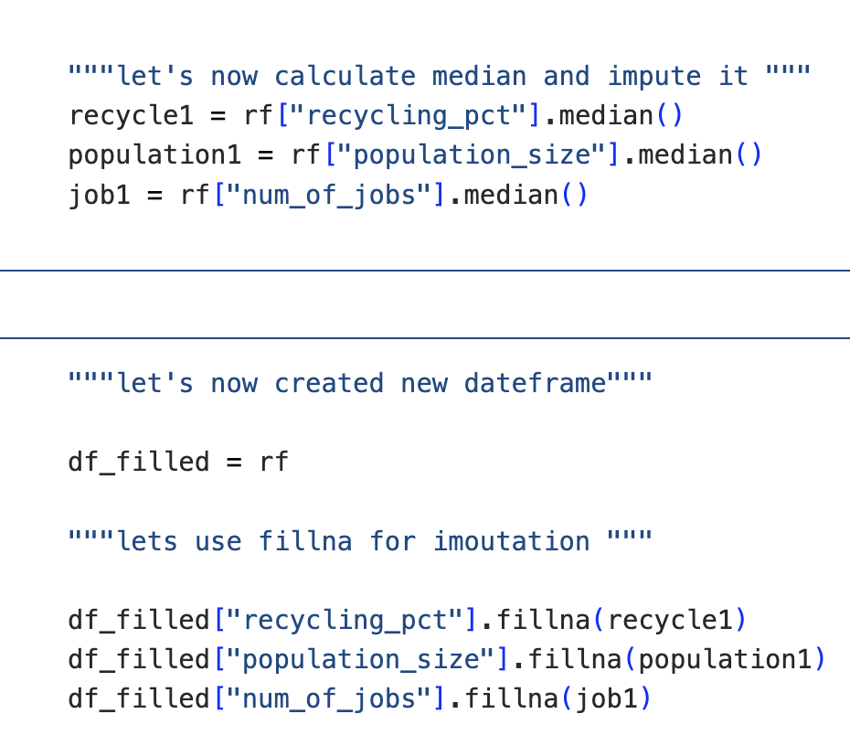

**Duplicate rows** were identified and removed both globally with **drop_duplicates()** and specifically within certain columns like recycling_pct, which helped eliminate redundant or repeated data entries.

## Applying Functions

Following data cleaning, we applied **various functions** to enhance the dataset. For instance, we defined a projected_salary function that increased median salaries by **3%**, which we then applied across the column using **.apply()**, creating a new column **median_salr_inflated**. 

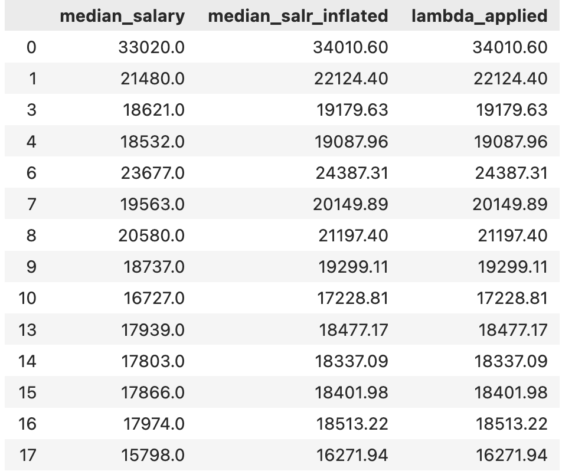

Additionally, we demonstrated the use of lambda functions to perform similar inline transformations concisely. To implement conditional logic at the row level, we created a function selection21 that applies a salary increase only if the number of jobs exceeds 120,000, otherwise returning 1. This function was applied **row-wise using df.apply(..., axis=1)**, resulting in a new column **row_lambda**. These steps illustrate how combining Pandas' vectorized operations with custom Python functions enables powerful, flexible data transformations and insights extraction.

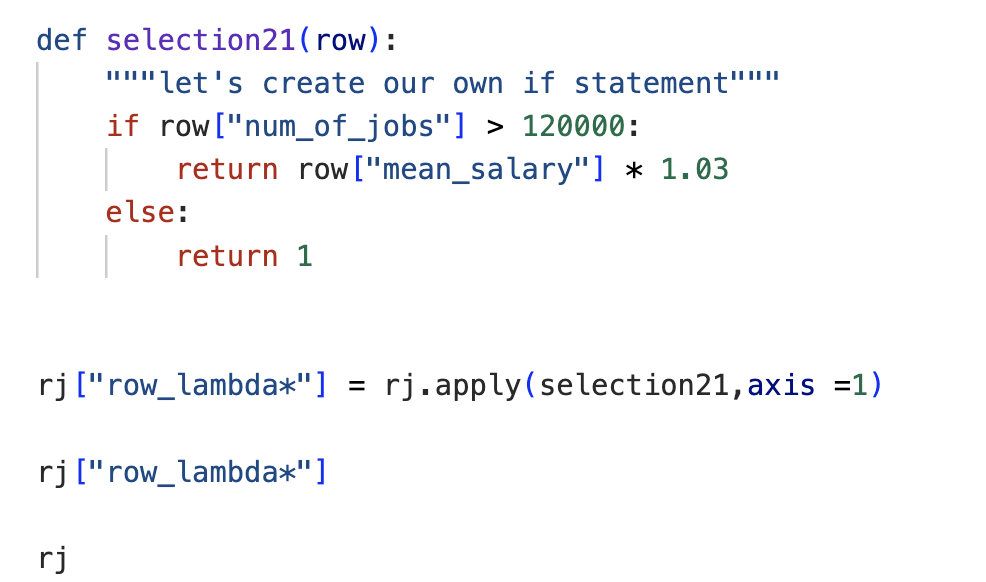

## Index Management,Pivot Table, Explode Function
### Section 1 - Index Management

We first assigned a custom name, **"value_index"**, to the DataFrame’s index to better identify it. We, then demonstrated how to locate rows with a specific value in the "area" column (e.g., "brent"). Since the resulting subset **rf_brent** may have a non-sequential index, we used **reset_index(inplace=True)** to reset the index back to the default integer sequence while preserving the old index as a column. 

To restore the original index as the DataFrame’s index, we then applied set_index("value_index", inplace=True). This workflow shows how we managed, reset, and reassigned indexes effectively to maintain clarity and order in the DataFrame.

### Section 2 - Pivot Table (pivot_table, group_by)

First, we counted the number of **job listings per job title** using two approaches: rf.groupby("job_title").size() and rf.pivot_table(index="job_title", aggfunc="size"). This gave us an overview of the distribution of job titles in the dataset. 

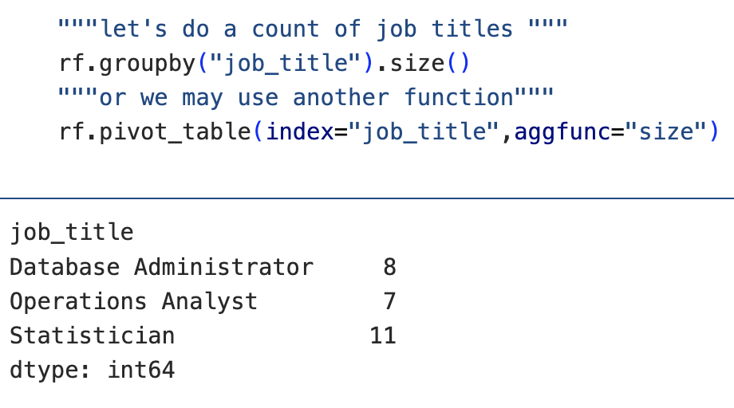

Next, we created a pivot table to analyze the average mean salary for each job title across different areas using **rf.pivot_table(values="mean_salary", index="area", columns="job_title", aggfunc="mean")**.   

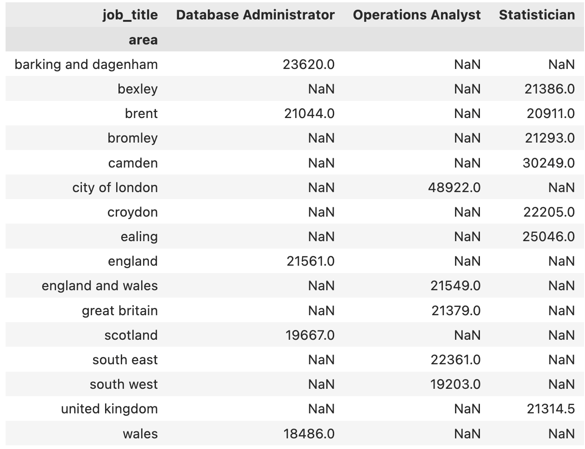

We then  identified the top **2 most frequent areas** using rf["area"].value_counts().head(2).index.A pivot table was created  with mean salaries by job title and area using **rf.pivot_table()**, filtered to keep only those top areas with **title_salary_ctr.loc[top61]**

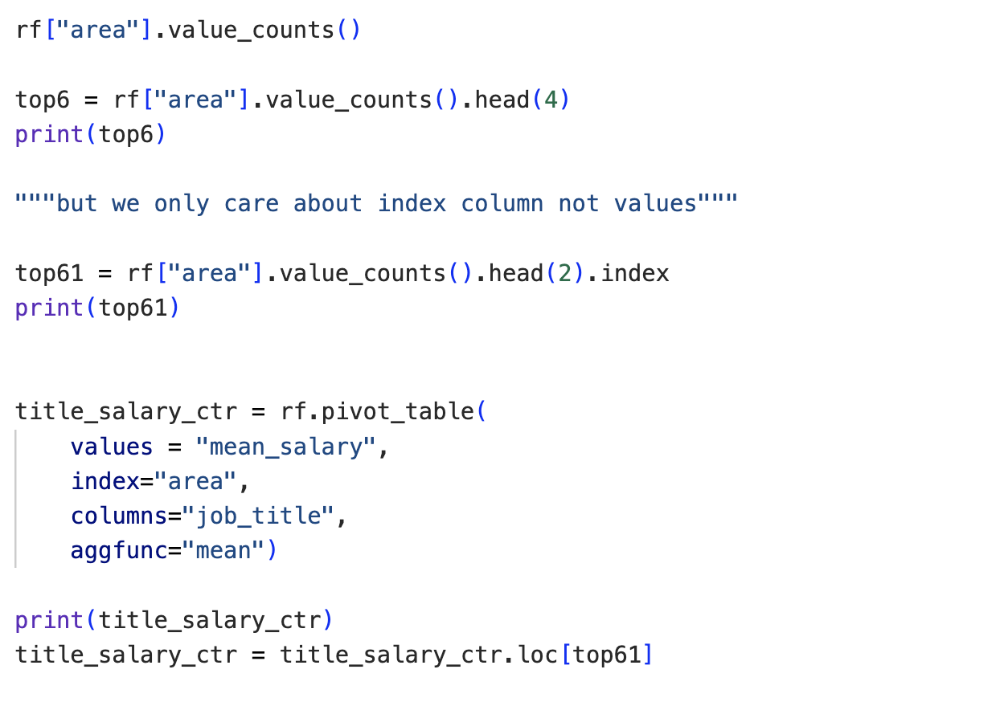

 Finally, we plotted the filtered data as a grouped bar chart to compare average salaries by job title within these key areas. 

 

### Section 3 - Explode Function

Wefirst converted the **"skills_list"** column from strings to actual Python lists using **ast.literal_eval with apply()**. Then, we applied the **explode() method** on the "skills_list" column to transform each list of skills into separate rows, making each skill its own row in the DataFrame **(rf_exploded = rf.explode("skills_list"))**. 

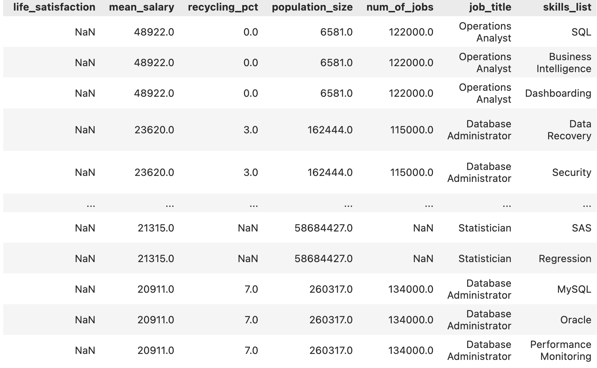

This made it possible to count **the frequency of each skill across different job titles** using **groupby (["job_title", "skills_list"]).size()**. The resulting Series was converted into a **DataFrame** with **.reset_index(name="skills_count")** to label the count column. 
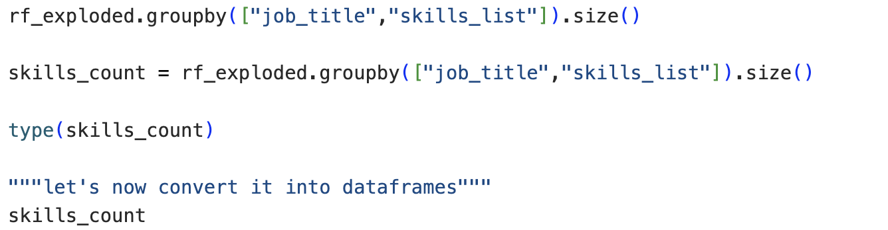

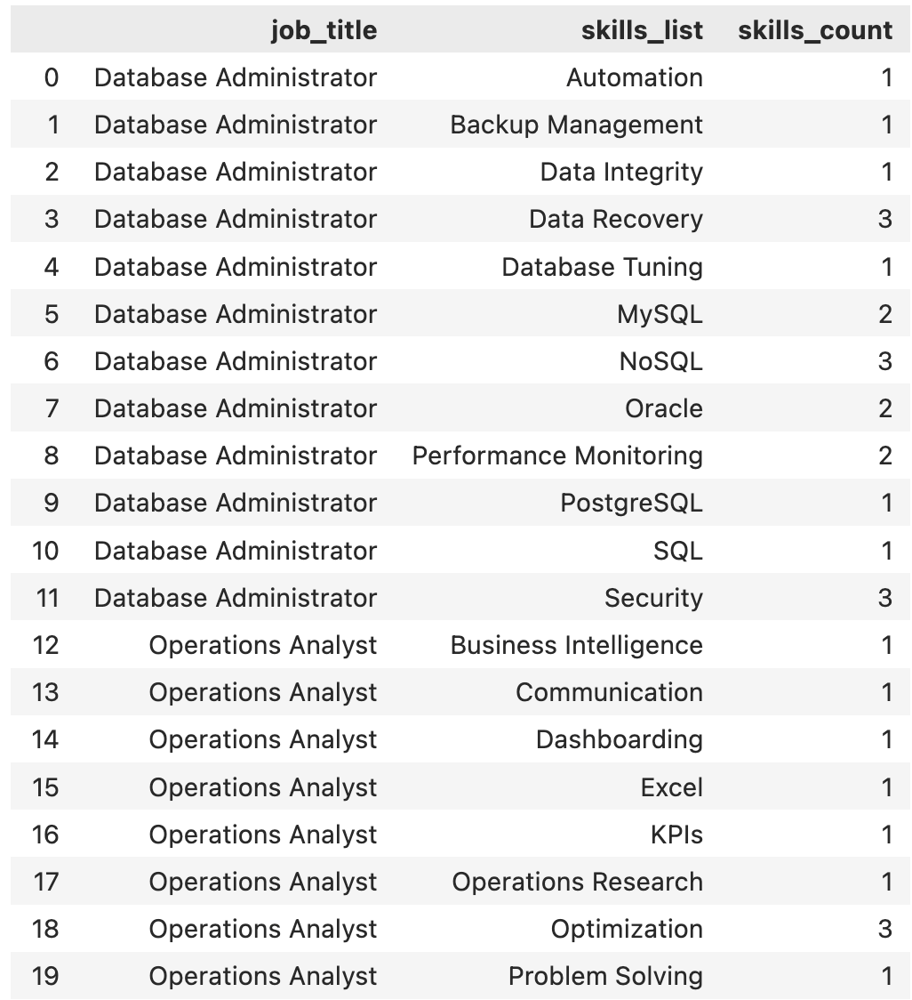

We sorted the DataFrame by **"skills_count" in descending order**, filtered the **top 5 skills** for the job title **"Statistician**," and finally plotted these counts with a horizontal bar chart using **plot (kind="barh", x="skills_list", y="skills_count")** to visualize the most in-demand skills for that role.    

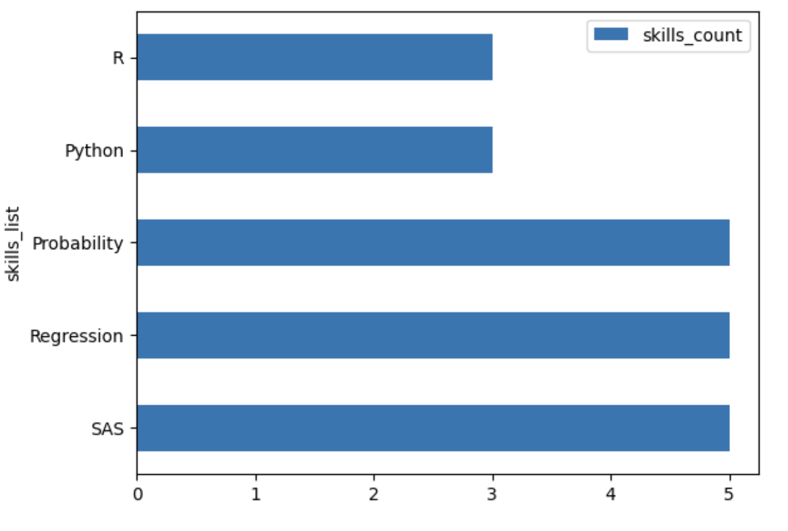

## Concat and Merge DataFrames
### Section 1 - Concat Method
#### Part 1
We loaded two CSV files into DataFrames (**m1** and **m2**) and combined them vertically using **pd.concat()**, effectively stacking the rows from one under the other. We also demonstrated **ignore_index=True** to reset the index in the merged DataFrame.
**m1:**

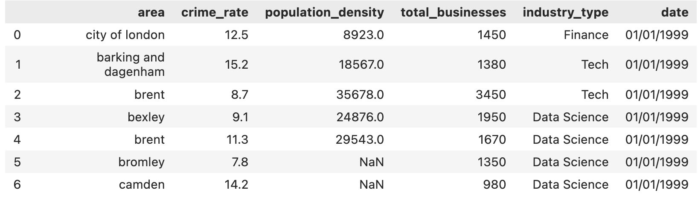

**m2:**

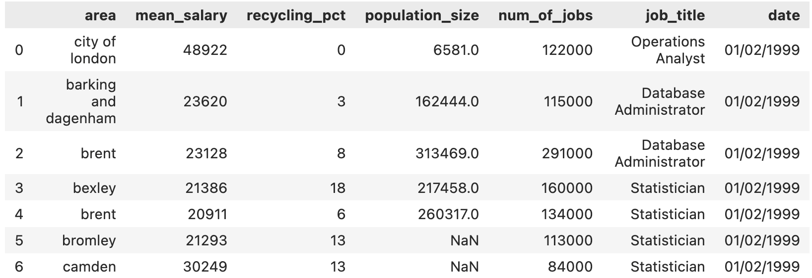

**Concated:**   
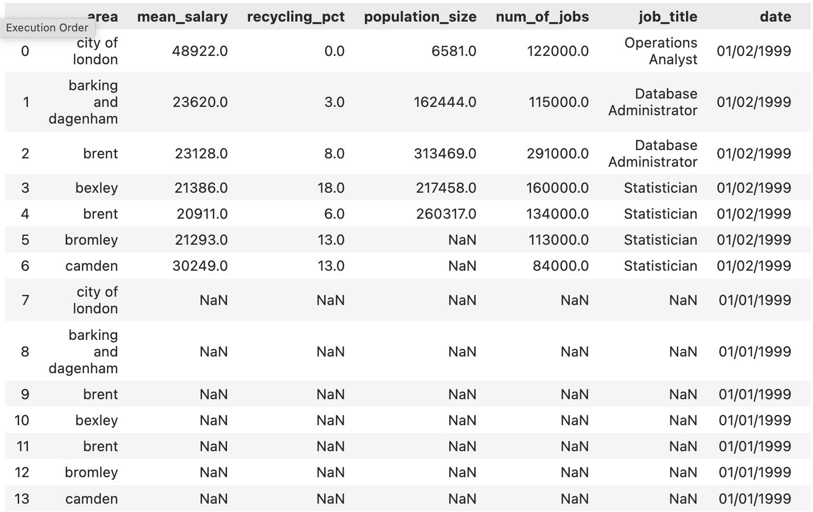

### Part 2

We started by converting column from string to **datetime objects** using pd.to_datetime(), enabling time-based operations.

We then created a new column **month_var** by extracting the **month abbreviation** from the date column with **.dt.strftime("%b").**

Next, we retrieved all distinct months present in the dataset using **.unique().**

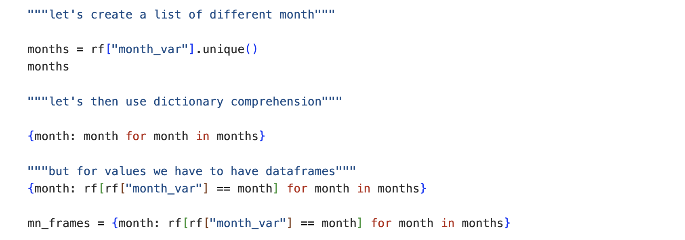

*A dictionary comprehension was used twice:*

**First**, to map each month abbreviation to itself ({month: month for month in months}).

**Then**, to map each month abbreviation to a filtered DataFrame containing only rows for that month ({month: rf[rf["month_var"] == month] for month in months}).

This second dictionary was stored in **mn_frames**, allowing easy access to month-specific subsets (e.g., mn_frames["Jan"]):

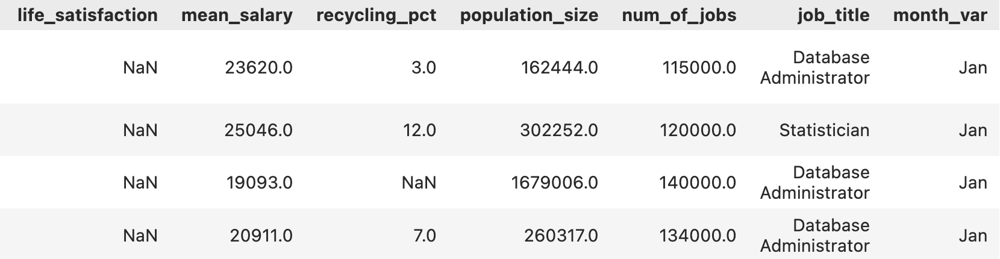

We then concatenated multiple monthly DataFrames **("Jan", "Feb", and "Apr")** using **pd.concat(..., ignore_index=True)** and stored the result in concated.
From this combined DataFrame, we calculated the **frequency of each month** using .**value_counts()** on the month_var column and stored it in value23.

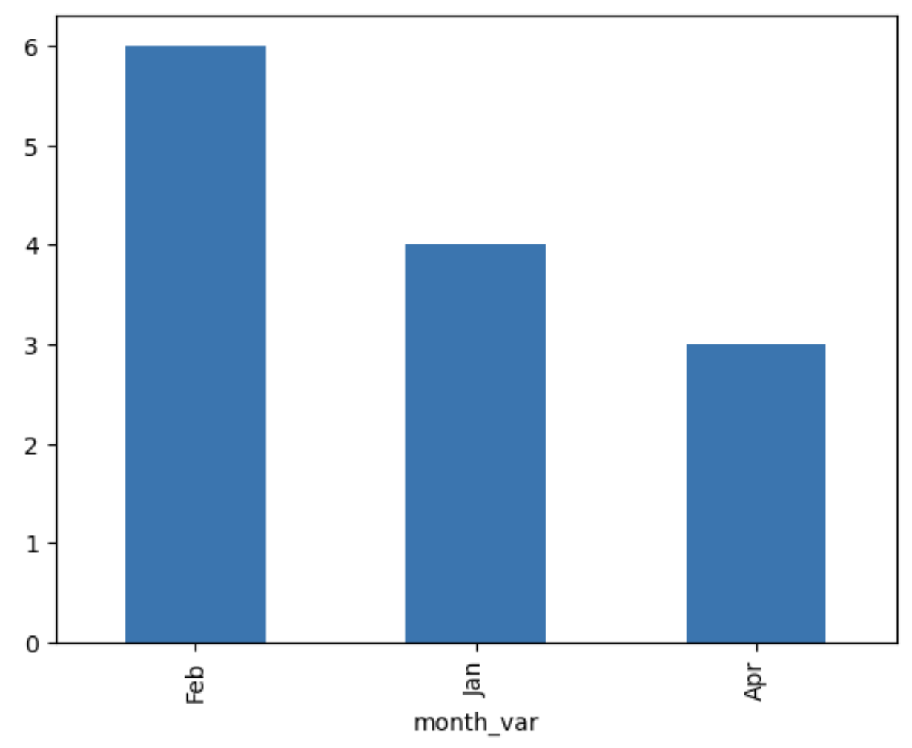

### Section 2 - Merge Method

We started by importing pandas and matplotlib.pyplot, then read two CSV files into DataFrames **m1** and **m2** using pd.read_csv().

**m1**:

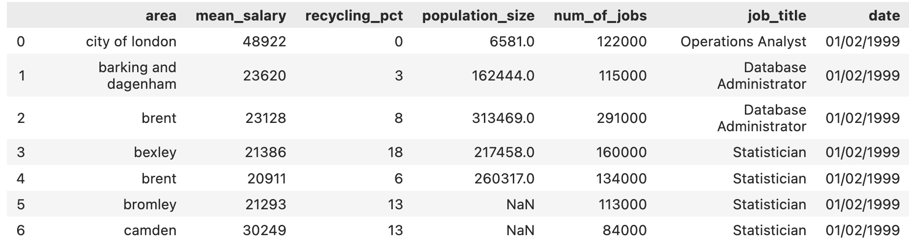

**m2**:

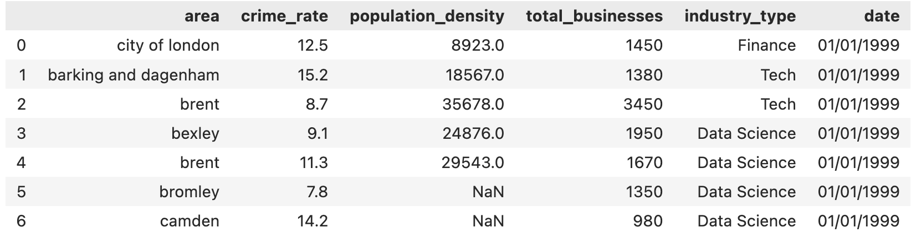

We then merged them with **.merge(on="area")**, storing the result in merged1.

We performed an **inner join** on the area column, meaning that **only rows with matching area values** in both DataFrames were kept.
If m1 has multiple rows with the same area value, this merge produces multiple matching rows depending on how many identical values exist in **m2**.

Next, we removed unnecessary columns **("area", "job_title", "industry_type")** from merged1 using .drop(columns=...), resulting in merged2 — a DataFrame containing only numeric columns suitable for aggregation.

**merged2:**

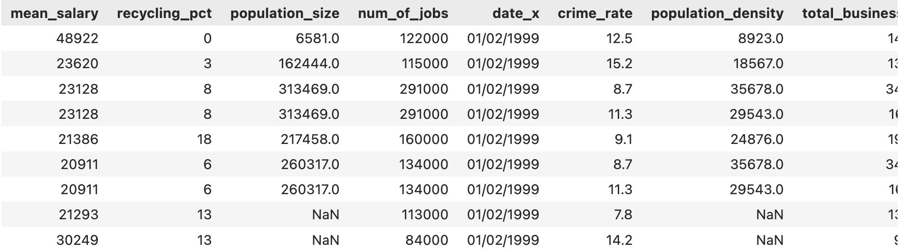

We then computed **two** key variables:

**sum1 →** total sum of each numeric column in merged2 using **.sum().**

**sum2 →** top 5 column names with the largest sums, obtained by chaining **.sum().head().index.to_list()** (though here .head() simply takes the first 5 columns, not the highest sums).

We then selected only the columns in sum2 from merged2 using **merged2[sum2]:**

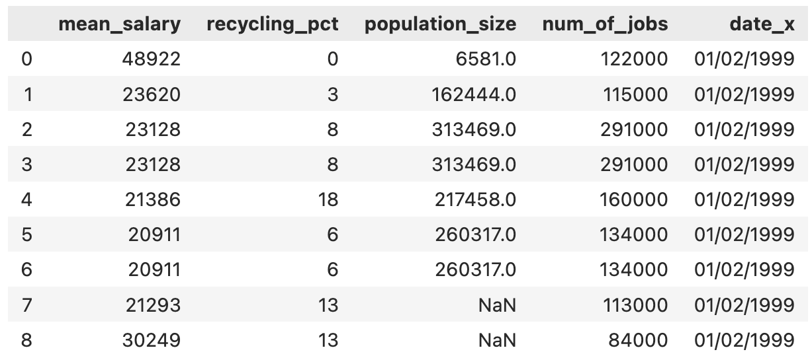

This subset was plotted as a line chart with **merged2[sum2].plot(kind="line")**

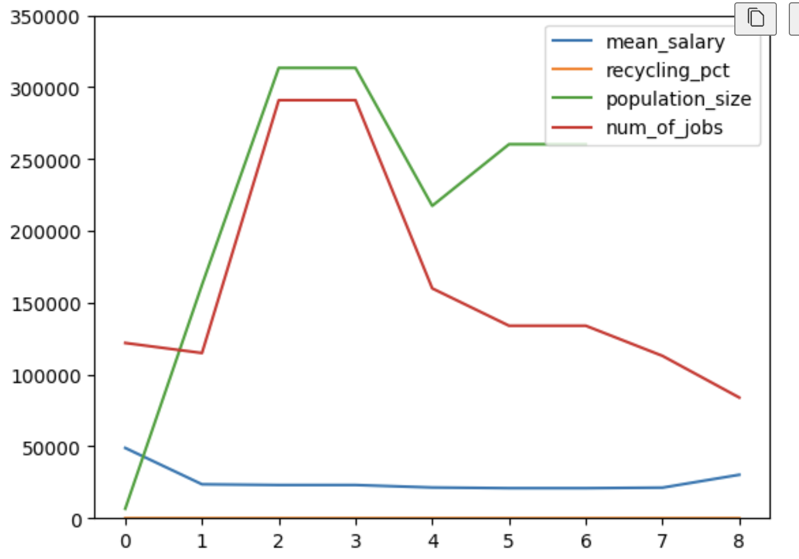

## Matplotlib 
### Histograms

We began by loading the dataset with pd.read_csv() and converting the "date" column to a **datetime** format using pd.to_datetime() to enable time-based operations. The **"skills_list"** column, which contained string representations of lists, was cleaned by applying ast.literal_eval() within .apply() so that each value became a proper Python list. 

 We then filtered the DataFrame to keep only rows where **"job_title"** equaled **"Statistician"**. Using the **"mean_salary"** column, we created a histogram with .plot(kind="hist", bins=10, edgecolor="black") to visualize the salary distribution.
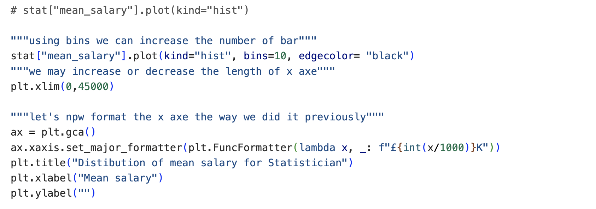

The x-axis range was limited with **plt.xlim(0, 45000)**, and tick labels were formatted into thousands with a **“£K”** style using **plt.FuncFormatter**. Lastly, We set a descriptive title and **customized axis labels** to make the chart clearer.

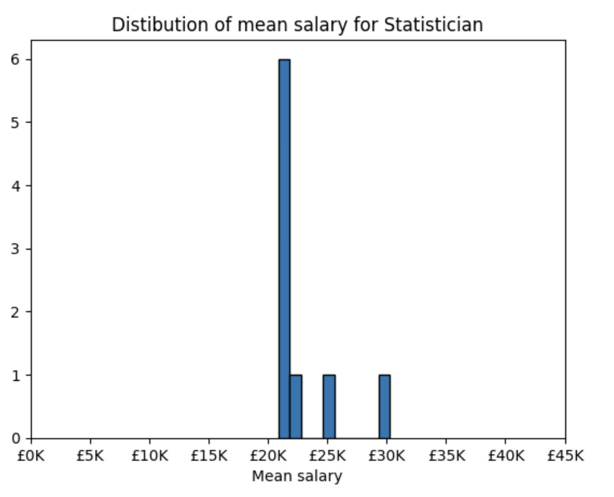

### Charts

**Firstly**, we used rf["job_title"].value_counts() and rf["area"].value_counts().head(5) to count job titles and the **top five** areas.

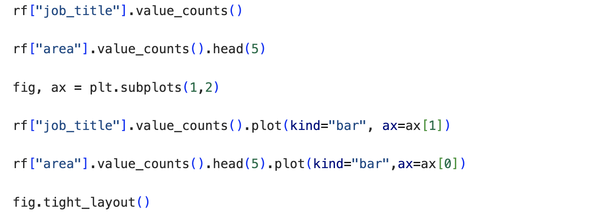

Then, we created a figure with two subplots using **plt.subplots(1, 2)**, where fig represents the whole figure and ax is an array of individual plot axes. We plotted job titles on **ax[1** and areas on **ax[0]** with .plot(kind="bar", ax=...), and finally **adjusted spacing** with fig.tight_layout() for a cleaner layout.

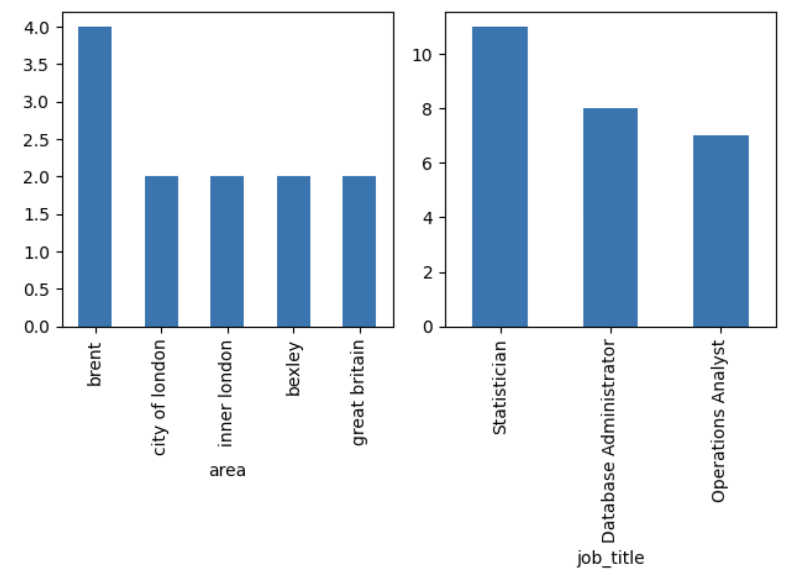

### Pie charts

#### Section 1 

**Firstly**, we loaded and cleaned the dataset by converting date to datetime and parsing skills_list with ast.literal_eval(). Then, we used **value_counts()** on job_title to count **each role**, plotted the results as a **pie chart** with startangle=90 and percentage labels (autopct="%1.1f%%"), set a title, removed the y-axis label, and displayed the chart.

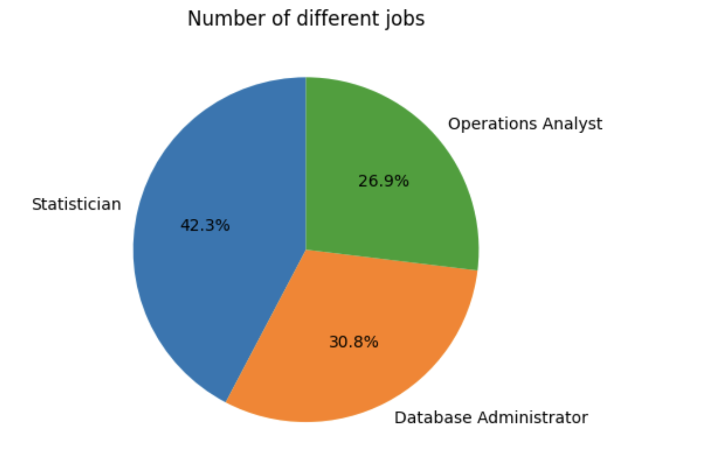

#### Section 2

We began by selecting the **three** relevant columns *(job_title, job__health_insurance, and work_from_home)* into a new DataFrame **rf_three**. Then, ywe created a subplot layout with one row and three columns using **plt.subplots(1,3)**, giving us three separate ax objects to work with. We defined a dictionary **dict1** to pair each column name with a descriptive chart title.

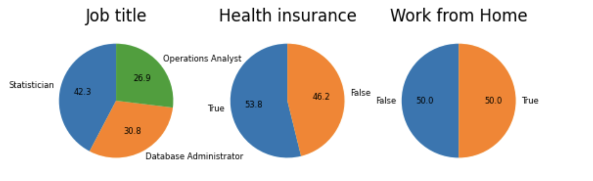

Using **a for loop** with enumerate(), we iterated over column–title pairs, used value_counts() to get **category counts**, and plotted them as pie charts with ax[i].pie(). We set a **90°** start angle, displayed **percentages** with autopct, reduced label **font size** via textprops={'fontsize': 6}, added **category names** as labels, and set individual **subplot titles** with ax[i].set_title().

### Scatter Plot

#### Section 1 

We first created an **artificial dataset** as a Python dictionary and converted it into a pandas **DataFrame** named rf using pd.DataFrame().

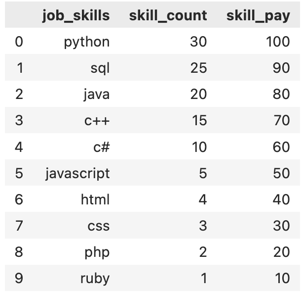

Then, we plotted **a scatter plot** with rf.plot(kind="scatter", x="skill_count", y="job_skills") to visualize **the relationship between skill counts and their corresponding job skills**.

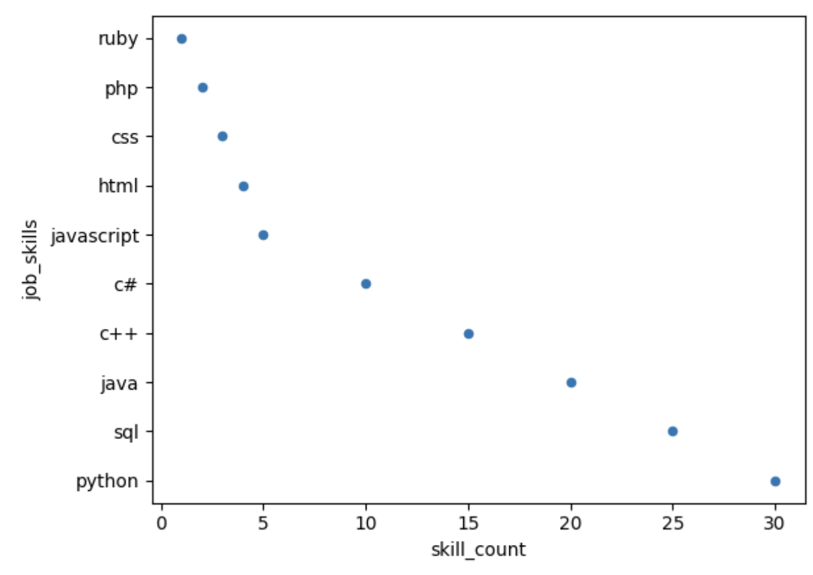

#### Section 2 

We **first** loaded the CSV file into the rf DataFrame.
Then, the date column was converted to a **datetime format** with pd.to_datetime(), and skills_list strings were converted to **Python lists** using ast.literal_eval() inside .apply().
We filtered the dataset to only include rows where job_title equals **"Statistician"** and used **.explode()** on skills_list so each skill had its own row.
Using **.groupby()** with .agg(), we created a new DataFrame that had **new_column** for the count of each skill and **stat_salary** for its median salary.

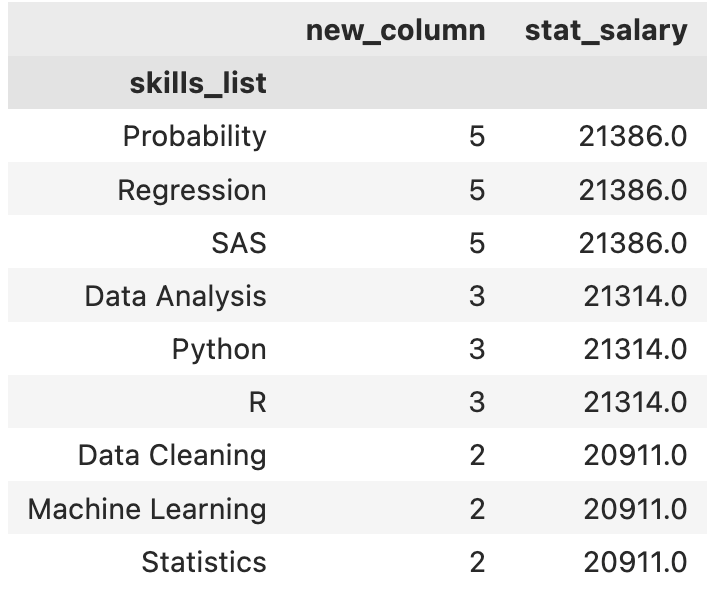

This **grouped DataFrame** was sorted in descending order of skill count with .sort_values().
We plotted **a scatter plot** with .plot(kind="scatter"), using new_column as the x-axis and stat_salary as the y-axis, then set axis labels and a title.

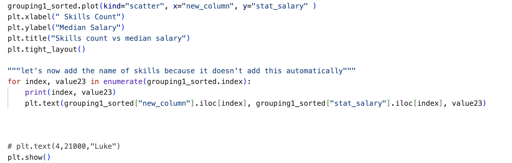

**Lastly**, we looped through the DataFrame index with **enumerate()** and used plt.text() to place each skill’s name next to its corresponding point in the chart.

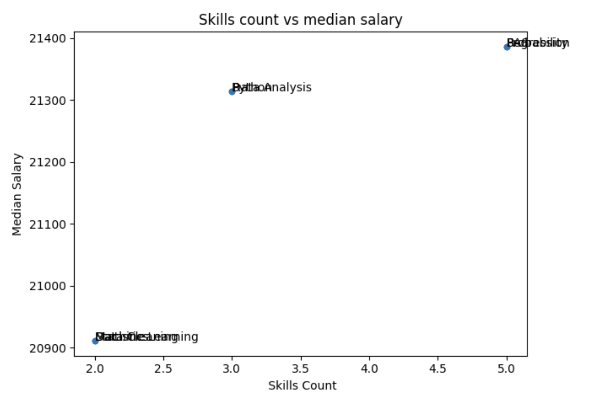

### Box Plot

#### Section 1
Firstly, we imported the required **libraries**, loaded the CSV into **rf**, converted the date column to **datetime**, and converted **skills_list** strings to Python lists.
Then, we **filtered** for rows where job_title is **"Statistician"**, dropped **missing value**s in mean_salary with .dropna(), and created a **horizontal box plot** of mean_salary using .plot(kind="box", vert=False).

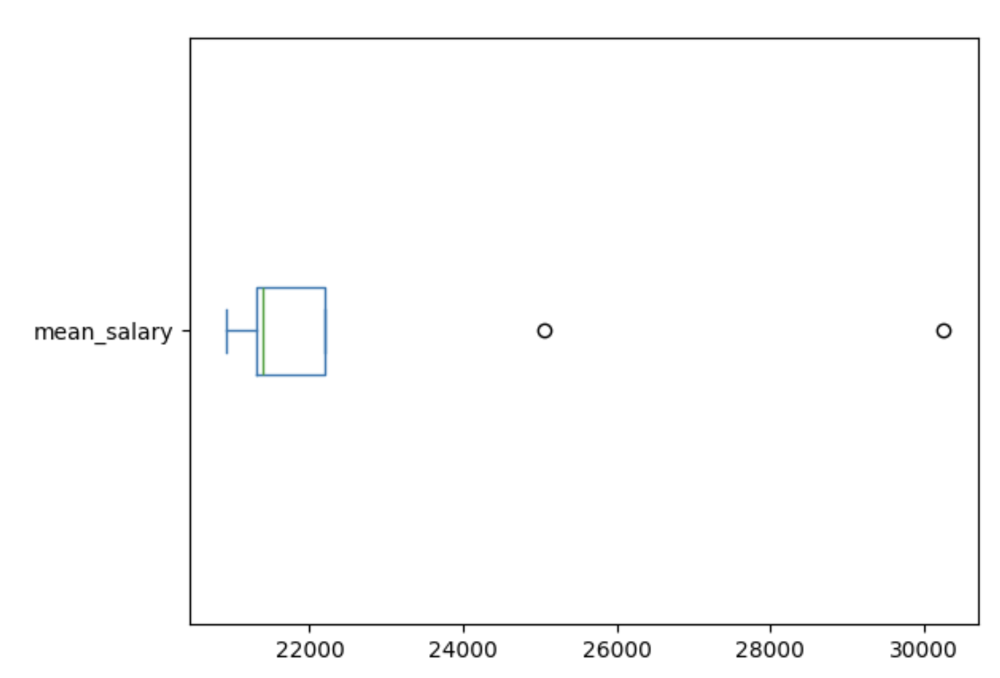

#### Section 2

Here, we defined **list_titles** with three job roles, copied the dataset to overall1, **dropped rows** with missing mean_salary using **.dropna()**, and extracted mean_salary values for each **job title** into a list comprehension job_list.
Finally, we plotted these **salary distributions** as a horizontal **box plot** with plt.boxplot() using the job titles as labels.

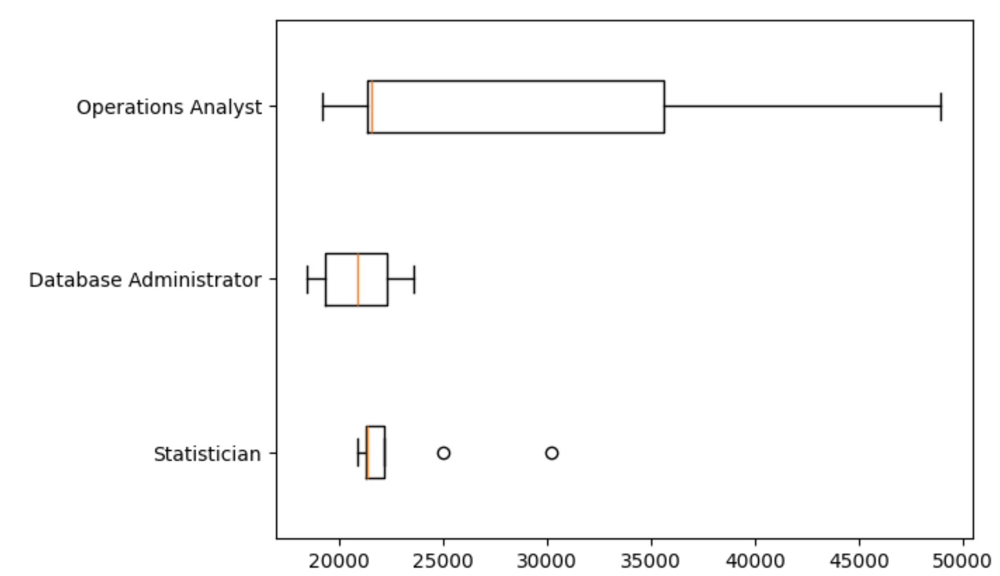

### Advanced Customization 

We started by importing pandas, matplotlib.pyplot, and ast, then loaded the dataset into the **rf** DataFrame.

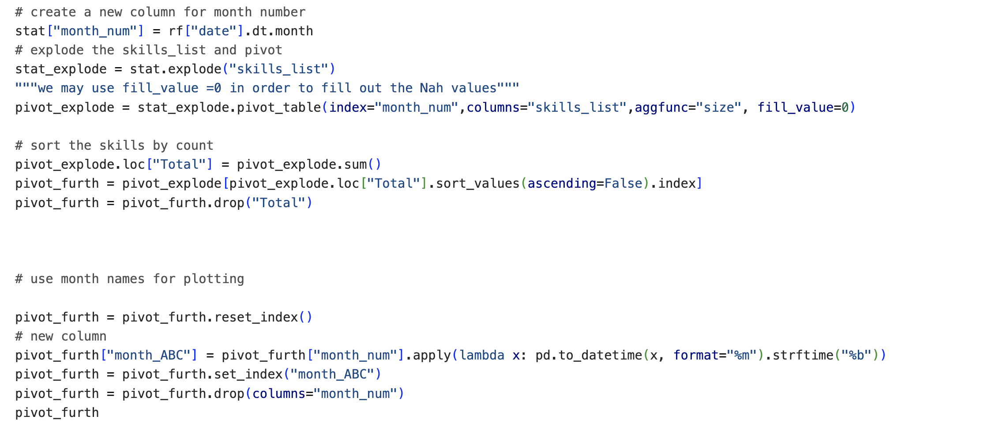

The date column was converted to **datetime** using pd.to_datetime(), and skills_list entries stored as **strings** were safely converted into Python **lists** with ast.literal_eval() applied via .apply().

We filtered **rf** to include only rows where **job_title** equals **Statistician**, created a new column **month_num** from the date values, and used .explode() to transform each list in skills_list into multiple **rows—one** per skill.

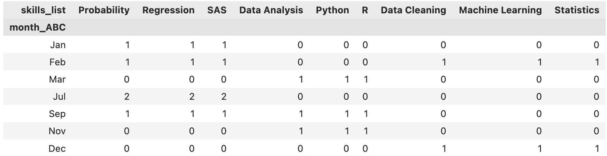

A pivot table was generated with pivot_table(), counting **occurrences of each skill** per month, filling missing counts with zeros using **fill_value=0**.

We calculated **totals across months** with .sum(), sorted skills by **overall frequency**, kept the **top ones**, replaced month numbers with **three-letter month** abbreviations using strftime("%b"), and dropped extra columns.

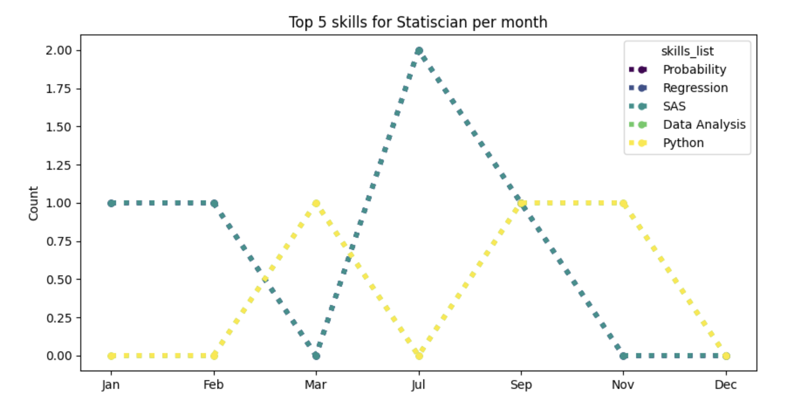

**Finally**, we plotted the **top 5 skills** as a **customized line chart** using a thicker linewidth, dotted linestyle, viridis colormap, circle markers, adjusted marker size, and a defined figsize—with labeled axes and a descriptive title.

## Seaborn 

### Introduction

We started by importing pandas, matplotlib.pyplot, ast, and later **seaborn**.
The dataset was loaded from CSV into **rf**, with date converted to **datetime format** and **skills_list** parsed from string representations into actual Python **lists** using ast.literal_eval().
We then filtered the data to only include rows where **job_title** was **"Statistician"**, created a copy, removed rows with **missing mean_salary values**, and used .explode() so that each skill appeared in a **separate row**.

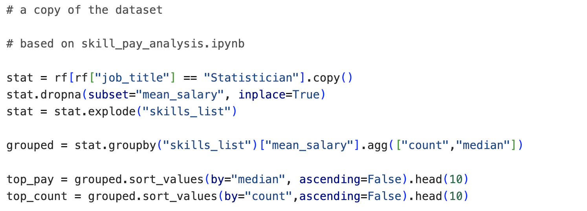

**Next**, we grouped the data by skills_list and aggregated **two metrics**: the number of occurrences **(count)** and the median salary **(median)**. From this grouped data, we created **two separate DataFrames** — top_pay for the **top 10 highest-paid skills** (sorted by median salary) and **top_count for the top 10 most in-demand skills** (sorted by count).

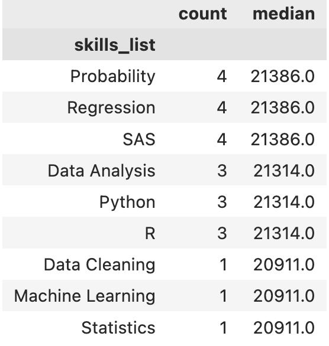

For visualization, we created **a two-row subplot layout** (fig, ax = plt.subplots(2, 1)) and set the Seaborn theme to **"whitegrid"** for a clean background.

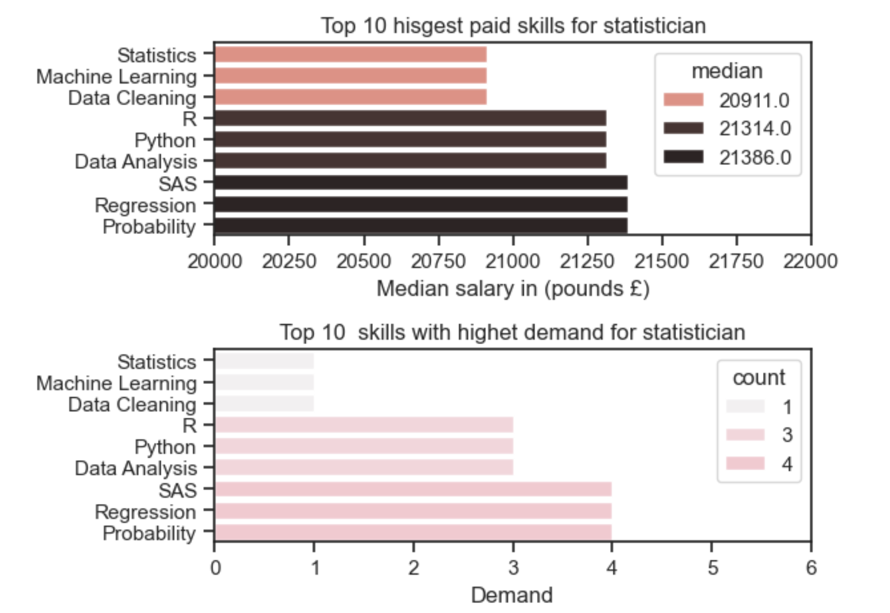

We plotted **top_pay** and **top_count** as horizontal bar charts with **sns.barplot()**, customizing colors (dark:salmon_r and light:pink), axis limits, and labels for clarity.

The **y-axes** were **inverted** to show the highest values at the top, and fig.tight_layout() was applied to prevent **overlapping** elements.

### Histogram 

We filtered the dataset for **Statisticians** and used **sns.displot()** with kind="kde" and **fill=True** to create a smooth, filled density plot of mean salaries.

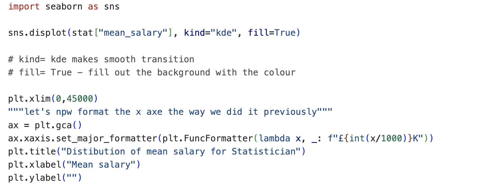

We set the x-axis limits to **0–45,000**, formatted the x-axis labels in **“£K”** using **FuncFormatter**, and added a title and axis labels for clarity.

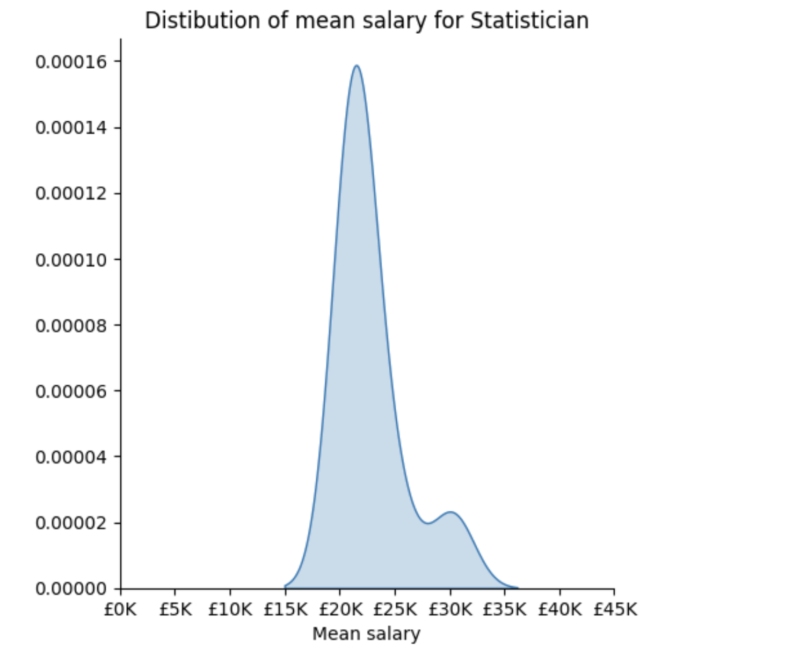

### Box Plot

We first filtered the dataset for **three specific job titles** and created a list of their **mean salaries**, then plotted these as a horizontal boxplot using plt.boxplot() to compare salary distributions.

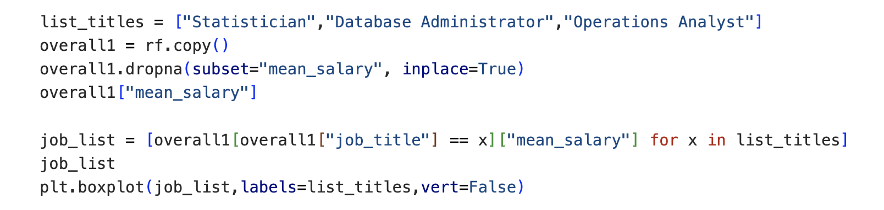

**Next**, we used **sns.boxplot()** to create a more **polished boxplot** of mean_salary across **all job titles** directly from the DataFrame, providing a visual comparison of salary distributions.

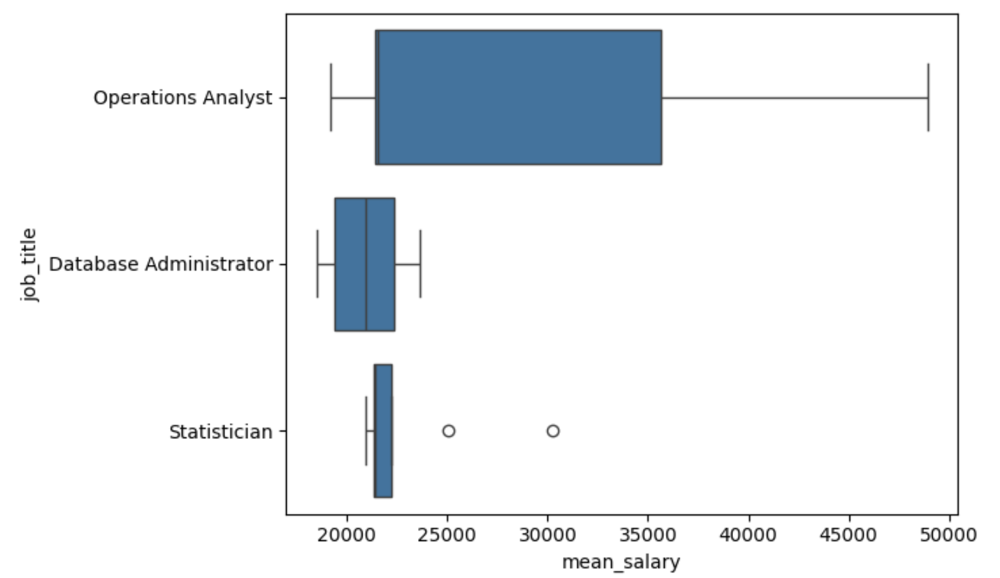

### Conclusion

This project demonstrated how **Python** and **Panda**s can be used to clean, transform, and analyze data effectively. By handling missing values, duplicates, and complex structures, and applying visualization with **Matplotlib**, we were able to extract meaningful insights and present them clearly. The workflow highlights the power of combining data manipulation and visualization for real-world analysis.

## How to Use  

1. **Install dependencies**: pandas, matplotlib, numpy.
2. **Load datasets**: use pd.read_csv() and adjust the file path/directory as needed.

## Author  
Created by **Arsen Pankiv**  
- [LinkedIn](https://www.linkedin.com/in/arsen-pankiv-6082b4349/)  
- [GitHub](https://github.com/Arsen-Pankiv)
